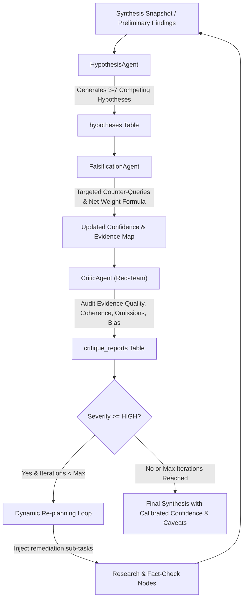

# Developer Guide

Welcome to the Research And Decision Intelligence System (RADIS) developer documentation. This guide provides an overview of the architecture, setup instructions, and engineering rules.

## Architecture Overview

RADIS is structured as a monorepo containing a Python backend and a pure JavaScript Vite + React frontend styled 1-to-1 with the Stitch MCP Design System.

- **Backend (`/backend`)**: Built with FastAPI and Python 3.12. It handles database interactions via async SQLAlchemy (supporting SQLite for local dev & PostgreSQL for production), orchestrates multi-agent workflows using a custom `BaseAgent` framework with an extended LangGraph conditional routing state machine (`should_reverify`, `should_replan`, `data_node`, `visualization_node`), manages LLM interactions, sandboxed Python code execution (`PythonSandboxTool`), safe SQL query inspection (`SQLTool`), CSV/Excel data profiling (`CSVTool`), chart spec generation (`ChartTool`), and exposes REST endpoints and SSE streams.
- **Frontend (`/frontend`)**: A pure JavaScript React application powered by Vite (running natively on **port 5173**). Features interactive data visualization card (`DataVisualizationCard.jsx`) and reproducible execution artifacts inspector modal (`DataArtifactsModal.jsx`).


## Quickstart Guide

### Prerequisites
- Python 3.12+
- Node.js 20+ & npm
- Docker & Docker Compose (optional, for containerized deployments)

### Backend Setup
1. Navigate to the backend directory: `cd backend`
2. Create a virtual environment: `python -m venv .venv`
3. Activate the environment:
   - Windows: `.\.venv\Scripts\activate`
   - Unix/macOS: `source .venv/bin/activate`
4. Install dependencies: `pip install -e ".[dev]"`
5. Copy `.env.example` to `.env` and configure optional LLM/Search API keys.

### Frontend Setup
1. Navigate to the frontend directory: `cd frontend`
2. Install dependencies: `npm install`
3. Configure `VITE_API_URL=http://localhost:8000/api/v1` if using a custom backend port.

## Running Locally

**Start the Backend (Development mode)**
```bash
cd backend
python -m uvicorn app.main:app --reload --port 8000
```
Backend API will be accessible at `http://localhost:8000`. Health check: `http://localhost:8000/health`.

**Start the Frontend (Development mode)**
```bash
cd frontend
npm run dev
```
The application will be accessible on Vite's native dev port: **`http://localhost:5173`**.

## No Non-Functional UI / No Dummy Data Policy

The codebase enforces a strict **Zero Non-Functional UI & Zero Dummy Data** policy:
- **Pruned Placeholder UI**: All non-functional links, dummy tabs, and dead buttons have been removed. Every visible element performs a real action (creating sessions, submitting queries, switching research modes, opening live terminal telemetry logs, copying evidence, or exporting PDF reports).
- **Web Search**: Integrates live DuckDuckGo HTML web search (`_duckduckgo_search`) in `backend/app/tools/web_search.py` so real searches run out-of-the-box without requiring API keys or mock data.
- **Real Error Handling**: Network or backend exceptions display real error banners with interactive retry triggers.

## Agent Engineering Rules

RADIS employs a strict set of rules for agent development to ensure reliability, predictability, and safety:

1. **Strict Budgeting:** All agents must enforce token limits, step limits, and timeout budgets (`asyncio.wait_for`). Runaway loops are strictly prohibited.
2. **Immutable State:** Agent state transitions must be predictable and auditable. State is passed and returned, not mutated globally.
3. **Graceful Degradation:** When APIs fail or timeouts approach, agents must yield real partial results or clear error states rather than crashing or inventing fake facts.
4. **Tool Safety:** All tools must be registered via the central registry with input schema validation. Content extractors enforce strict SSRF protections (`is_safe_url`).
5. **Separation of Concerns:** The Supervisor Agent plans and delegates; Research Agents execute and gather. Never mix orchestration with execution.
6. **Streaming First:** Intermediate progress and evidence emit via SSE to drive real-time UI.
7. **Phase 3 Evidence Intelligence Pipeline:**
   - **`ClaimExtractor` & `ConfidenceEngine`**: Extracts atomic claims into a 7-type taxonomy and scores them via weighted formulas.
   - **`SourceScorer`**: Assesses credibility, freshness, and independence of sources.
   - **`FactCheckAgent`**: Uses 3 search strategies (Direct, Authority, Counter-evidence) and enforces strict URL/`content_hash` deduplication.
   - **`ContradictionAgent`**: Runs a 5-check detection pipeline for conflicts, assigns severity scores, and drives a resolution state machine.
   - **`ProvenanceAgent`**: Builds the Evidence Graph engine.
   - **LangGraph Routing (`should_reverify`)**: Routes execution to additional verification loops if confidence is low or contradictions are severe.

## Phase 4 RAG Pipeline Architecture & Extensibility

Phase 4 equips RADIS with an internal document processing engine, vector database storage, and hybrid retrieval algorithms.

### 1. RAG Pipeline Architecture

```
[Uploaded Document] 
      │
      ▼
┌───────────────────────────┐
│  DocumentParserFactory    │ ── (Parses PDF, DOCX, TXT, Markdown)
└─────────────┬─────────────┘
              │ Extract raw text & section metadata
              ▼
┌───────────────────────────┐
│   SemanticChunker         │ ── (Parent-Child Hierarchical Chunking)
└─────────────┬─────────────┘
              │ Chunks & hierarchy
              ▼
┌───────────────────────────┐
│     EmbeddingService      │ ── (Generates dense vector embeddings)
└─────────────┬─────────────┘
              │ 
      ┌───────┴────────┐
      ▼                ▼
┌───────────┐    ┌───────────┐
│  Qdrant   │    │  BM25     │
│ (Dense)   │    │ (Sparse)  │
└─────┬─────┘    └─────┬─────┘
              │                │
              └───────┬────────┘
                      ▼
┌───────────────────────────┐
│ Reciprocal Rank Fusion    │ ── (RRF combining Dense + Sparse search)
└─────────────┬─────────────┘
              ▼
┌───────────────────────────┐
│  Cross-Encoder Reranker   │ ── (Multi-stage precision score elevation)
└─────────────┬─────────────┘
              ▼
┌───────────────────────────┐
│     CitationMapper        │ ── (Source Attribution: [Doc: name, Page: X])
└───────────────────────────┘
```

The key modules in `app/rag` perform:
1. **Multi-Format Document Parsing (`app/rag/parsers`)**: Selects appropriate parser via `DocumentParserFactory` based on MIME type or file extension.
2. **Hierarchical Semantic Chunking (`app/rag/chunking`)**: `SemanticChunker` splits document content into macro parent chunks and granular child chunks, preserving section headings, page numbers, and offsets.
3. **Qdrant Vector Store (`app/rag/vector`)**: `QdrantClientManager` handles collection provisioning, vector upserts with payload metadata, payload filtering by session ID, and collection cleanup.
4. **BM25 Keyword Engine (`app/rag/search/bm25_engine.py`)**: Computes sparse BM25 scores over chunk corpora for exact lexical and keyword matches.
5. **Hybrid Search & RRF (`app/rag/search/hybrid_search.py`, `rrf.py`)**: Combines dense Qdrant vector scores and sparse BM25 keyword scores using Reciprocal Rank Fusion (RRF) parameterized by `alpha`.
6. **Cross-Encoder Reranking (`app/rag/search/reranker.py`)**: Rescores candidate chunks against search query using cross-encoder scoring.
7. **Citation Mapping (`app/rag/citations/citation_mapper.py`)**: Attaches structured citation references (`[Doc: filename, Page: X, Chunk: Y]`) to chunk payloads injected into LLM context windows.

### 2. Parser Factory Extensibility Guide

To add support for a new document format (e.g. `CSVParser` or `HTMLParser`):

1. **Implement `BaseDocumentParser` Subclass**:
   Create a new file in `app/rag/parsers/my_parser.py`:
   ```python
   from app.rag.parsers.base import BaseDocumentParser, ParsedDocument

   class MyCustomParser(BaseDocumentParser):
       async def parse(self, file_path: str) -> ParsedDocument:
           # Extract text content, page divisions, sections, and metadata
           return ParsedDocument(
               content="Extracted full document text...",
               metadata={"format": "custom"},
               pages=[{"page_number": 1, "text": "..."}],
               sections=[{"title": "Header", "start_offset": 0}]
           )
   ```

2. **Register Parser in `DocumentParserFactory`**:
   Update `app/rag/parsers/factory.py`:
   ```python
   _MIME_MAP: dict[str, Type[BaseDocumentParser]] = {
       ...
       "application/x-custom": MyCustomParser,
   }

   _EXTENSION_MAP: dict[str, Type[BaseDocumentParser]] = {
       ...
       ".custom": MyCustomParser,
   }
   ```

3. **Add Tests**:
   Add unit tests in `tests/unit/test_phase4_rag.py` to verify factory registration, text extraction, and metadata assignment.

### 3. Instructions for Running Qdrant Locally

**Option 1: Docker Compose (Recommended)**
Start Qdrant container alongside PostgreSQL and Redis:
```bash
docker-compose up -d qdrant
```
- REST API: `http://localhost:6333`
- Web Dashboard: `http://localhost:6333/dashboard`
- gRPC Port: `6334`

**Option 2: Standalone Docker Container**
```bash
docker run -d -p 6333:6333 -p 6334:6334 \
    -v qdrant_data:/qdrant/storage \
    --name radis-qdrant \
    qdrant/qdrant:latest
```

**Checking Service Status:**
```bash
curl http://localhost:6333/healthz
```
Expected response: `{"title":"qdrant","status":"ok"}`.

## Phase 5 Self-Challenge & Dynamic Re-planning Architecture

Phase 5 introduces autonomous self-challenge mechanisms: competing hypothesis generation, active falsification audits, independent red-team critique, and dynamic graph re-planning.

### 1. Self-Challenge Architecture & Workflow



### 2. Phase 5 Specialist Agents & Contracts

All Phase 5 agents inherit from `BaseAgent` and strictly enforce Pydantic V2 input/output contracts (`app/agents/agent_contracts.py`):

1. **`HypothesisAgent` (`app/agents/hypothesis.py`)**:
   - **Purpose**: Decomposes a research query into 3–7 competing, falsifiable hypothesis items (Primary, Alternative, Null).
   - **Contract**:
     - Input: `HypothesisAgentInput(query_text: str, existing_claims: List[Dict], existing_sources: List[Dict])`
     - Output: `HypothesisAgentOutput(hypotheses: List[HypothesisItem], investigation_priorities: List[str])`
   - **Key Fields**: `statement`, `initial_confidence` (0.5), `discriminating_evidence_needed`.

2. **`FalsificationAgent` (`app/agents/falsification.py`)**:
   - **Purpose**: Formulates targeted disconfirming search queries (`"evidence disproving or refuting: ..."`), retrieves potential counter-evidence, and calculates net-weight updated confidence.
   - **Contract**:
     - Input: `FalsificationInput(hypothesis: HypothesisItem, research_context: str)`
     - Output: `FalsificationOutput(hypothesis_id: str, evidence_items: List[Dict], updated_confidence: float, status_summary: str)`
   - **Confidence Formula**:
     $$\text{Net Weight Ratio} = \frac{\sum W_{\text{supports}} - \sum W_{\text{falsifies}}}{\sum W_{\text{supports}} + \sum W_{\text{falsifies}}}$$
     Mapped linearly from $[-1, 1]$ to $[0, 1]$ and bounded to $[0.0, 1.0]$.

3. **`CriticAgent` (`app/agents/critic.py`)**:
   - **Purpose**: Independent red-team review auditing findings across 4 distinct dimensions without shared state during audit:
     1. *Evidence Quality*: Single-source dependencies, low confidence ($< 0.60$), unverified status.
     2. *Logical Coherence*: Reasoning validity and unstated assumptions.
     3. *Completeness*: Omitted variables (e.g., `financial_cost`, `regulatory_compliance`, `risk_mitigation`).
     4. *Bias Detection*: Confirmation bias ($100\%$ supported claims) and framing bias.
   - **Contract**:
     - Input: `CriticInput(synthesis: str, evidence_chain: List[Dict], hypotheses: List[HypothesisItem], claims: List[Dict])`
     - Output: `CriticOutput(findings: List[str], weak_evidence: List[Dict], missing_variables: List[Dict], overall_severity: str, recommendations: List[str], replan_recommended: bool)`

### 3. Database Table Schemas

Phase 5 adds two primary database entities mapped via SQLAlchemy in `app.models.hypothesis` and `app.models.critique_report`:

1. **`hypotheses` Table (`Hypothesis` model)**:
   - `id`: UUID (PK, default `uuid4`)
   - `query_id`: UUID (FK to `queries.id`, `ondelete="CASCADE"`, indexed)
   - `statement`: Text (Non-null)
   - `status`: String (Default `"proposed"`; enum: `proposed`, `active`, `supported`, `falsified`, `inconclusive`)
   - `confidence`: Float (Default `0.5`)
   - `supporting_claim_ids`: JSON (List of claim UUIDs)
   - `falsifying_claim_ids`: JSON (List of claim UUIDs)
   - `evidence_map`: JSON (List of `EvidenceMapItem` dicts)
   - `falsification_attempts`: Integer (Default `0`)
   - `max_falsification_attempts`: Integer (Default `5`)
   - `metadata`: JSON (Additional metadata such as discriminating evidence lists)
   - `created_at`, `updated_at`: TimestampMixin

2. **`critique_reports` Table (`CritiqueReport` model)**:
   - `id`: UUID (PK, default `uuid4`)
   - `query_id`: UUID (FK to `queries.id`, `ondelete="CASCADE"`, indexed)
   - `synthesis_snapshot`: Text (Non-null)
   - `findings`: JSON (List of finding string summaries)
   - `weak_evidence`: JSON (List of `WeakEvidenceItem` dicts)
   - `missing_variables`: JSON (List of `MissingVariableItem` dicts)
   - `overall_severity`: String (Default `"LOW"`; enum: `LOW`, `MEDIUM`, `HIGH`, `CRITICAL`)
   - `recommendations`: JSON (List of actionable remediation recommendations)
   - `replan_triggered`: Boolean (Default `False`)
   - `iteration`: Integer (Default `1`)
   - `created_at`, `updated_at`: TimestampMixin

### 4. Dynamic Re-planning Workflow & Loop Controls

The LangGraph orchestration engine (`app/agents/graph.py`) incorporates a dynamic feedback loop:

1. **Evaluation**: Following `SynthesisAgent` and `CriticAgent` execution, the `should_replan` conditional edge evaluates the red-team critique report.
2. **Trigger Condition**: If `overall_severity` is rated `HIGH` or `CRITICAL` (or `replan_recommended == True`) and current loop count is below `max_replan_iterations` (default `3`), `replan_triggered` is set to `True`.
3. **Task Injection**: The loop-back action dynamically injects targeted research sub-tasks derived from `remediation` and `missing_variables` recommendations directly back into the `ResearchAgent` and `FactCheckAgent` queues.
4. **Safety & Termination**:
   - Loop iterations are strictly bounded by `max_replan_iterations`.
   - If iteration limit is reached while severity remains elevated, the system finalizes synthesis marked with `finalized_with_caveats = True` and explicit risk warnings.

## Phase 6 Decision Intelligence Architecture

Phase 6 introduces quantified decision support, multi-criteria decision analysis (MCDA), best/base/worst scenario modeling, weight sensitivity stress-testing, expected value calculations, and decision tripwire triggers.

### 1. Decision Intelligence Engine & Tools

Key modules in `app/tools/decision_tools.py` perform pure-Python, deterministic decision calculations:
1. **`compare_options`**: Multi-attribute utility matrix engine. Normalizes criteria weights ($\sum w_j = 1.0$), validates raw scores in $[0.0, 1.0]$, computes weighted total $S_i = \sum w_j \times s_{ij}$, and ranks alternatives.
2. **`run_scenario`**: Evaluates options across Best-case (25%), Base-case (50%), and Worst-case (25%) scenarios with probability distribution normalization.
3. **`run_sensitivity`**: Sweeps criterion weights from 0.0 to 1.0 in `step_size` increments while re-normalizing other criteria proportionally. Identifies exact crossover/switch points where top recommendation flips.
4. **`calculate_expected_value`**: Computes probabilistic expected payoff $EV_i = \sum p_k \times v_{ik}$ across scenarios.

### 2. Decision Agent & Service Architecture

1. **`DecisionAgent` (`app/agents/decision.py`)**: Specialist agent extending `BaseAgent`. Executes multi-criteria scoring, scenario simulation, sensitivity stress-testing, expected value calculation, and decision trigger identification.
2. **`DecisionService` (`app/services/decision_service.py`)**: Manages decision CRUD operations, orchestrates agent execution, persists structured decision records to the database, and executes custom sensitivity/scenario re-runs.

### 3. Database Table (`decisions`)

The `decisions` table (`app/models/decision.py`) tracks:
- `recommendation` & `confidence`
- `alternatives` & `criteria` JSON lists
- `weighted_matrix` JSON
- `scenarios` & `sensitivity_analysis` JSON
- `expected_values` & `decision_triggers` JSON
- Foreign key `query_id` referencing `queries.id` with `ON DELETE CASCADE`.

## Testing & Audit Commands

**Backend:**
- Module imports check: `python -c "import app.models; import app.schemas; import app.agents; import app.tools; import app.services; import app.api.v1.router"`
- Pytest Unit & Contract Tests: `python -m pytest tests/`
- Ruff Linter: `ruff check app`
- Type checking: `mypy app`

**Frontend:**
- Vite Production Build: `npm run build`
- React Doctor Quality Audit: `npx react-doctor .` (Audited: **100/100 Great score**)


