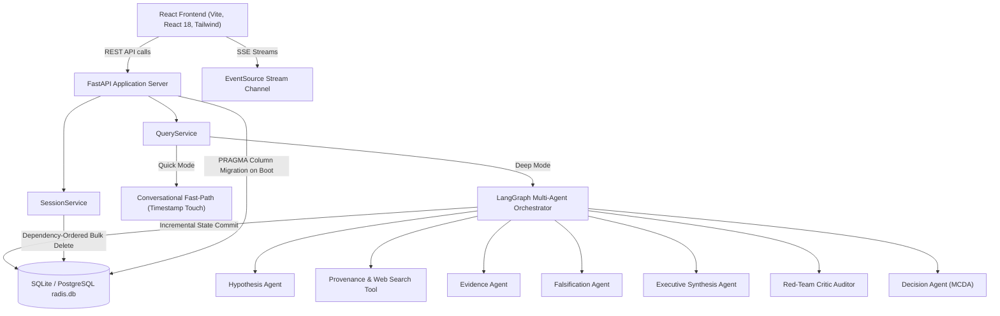
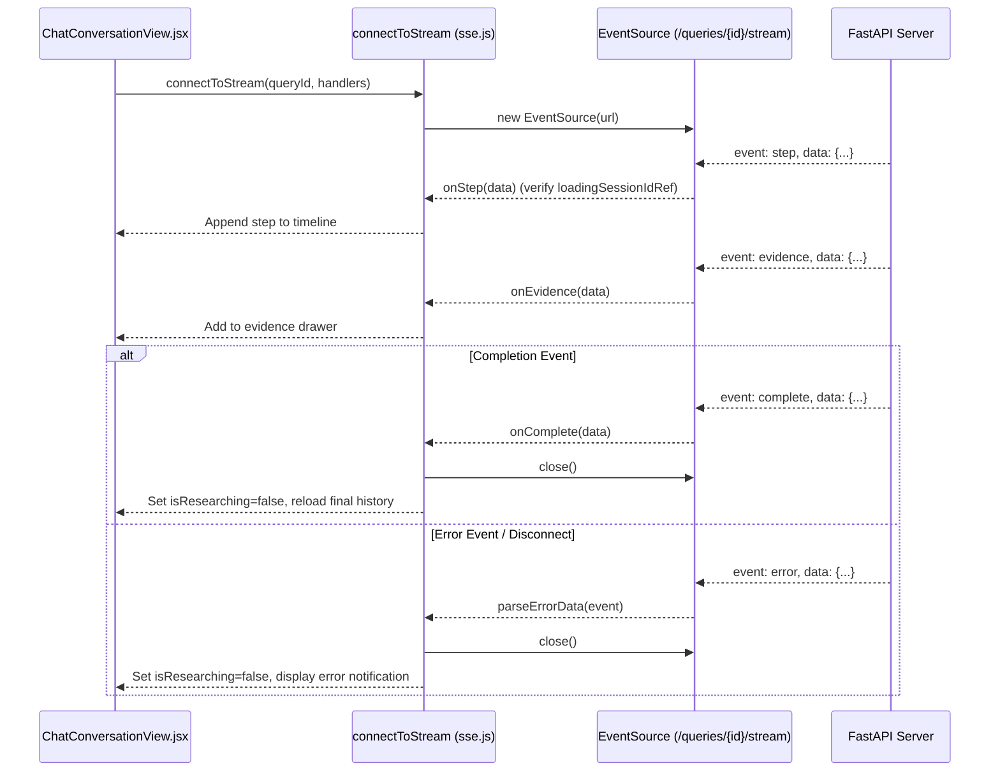

# RADIS Developer Guide: Architecture, React Best Practices & Engineering Specifications

## Overview
This developer guide provides an authoritative reference for engineers developing and maintaining the **Research And Decision Intelligence System (RADIS)**. It covers architectural patterns, state synchronization, **React StrictMode compliance**, **session persistence with `localStorage`**, **Server-Sent Events (SSE) connection management**, **LangGraph multi-agent execution**, and **testing workflows**.

---

## 1. Architecture Overview

### 1.1 High-Level System Architecture



---

## 2. Frontend React Engineering & Best Practices

### 2.1 React StrictMode Lifecycle Compliance
React 18+ in development mode mounts, unmounts, and immediately remounts all components to surface unintended side effects and resource leaks. In complex asynchronous applications managing WebSockets, SSE streams, and REST fetches, naive `useEffect` implementations lead to severe bugs:
- Zombie EventSource connections that remain open in the background.
- Race conditions where asynchronous fetches from unmounted instances resolve after the second mount has begun, causing stale state overwrites.
- Layout flashing and multiple conflicting render passes.

#### Best Practice Pattern: Subscription Cancellation & Unmount Cleanup
Always implement an `isSubscribed` cancellation flag combined with clean teardown of network streams:

```javascript
// Example from frontend/src/App.jsx
useEffect(() => {
  let isSubscribed = true;

  async function initializeWorkspace() {
    try {
      setIsLoadingInitial(true);
      const res = await api.getSessions(50);
      if (!isSubscribed) return; // Discard resolution if component unmounted

      let fetchedSessions = res?.items || [];
      // ... process and hydrate target session ...

      if (!isSubscribed) return;
      setSessions(fetchedSessions);
      await loadSessionHistory(targetSession.id);
    } catch (err) {
      if (!isSubscribed) return;
      setErrorMsg('Failed to load workspace.');
    } finally {
      if (isSubscribed) {
        setIsLoadingInitial(false);
      }
    }
  }

  initializeWorkspace();

  return () => {
    isSubscribed = false; // Invalidate first mount resolution
    if (streamCleanupRef.current) {
      streamCleanupRef.current(); // Teardown active SSE connection
      streamCleanupRef.current = null;
    }
  };
}, [loadSessionHistory, resetWorkspace]);
```

#### Best Practice Pattern: Concurrency Token Refs
When users switch rapidly between threads or items, asynchronous network calls for thread $A$ may resolve after the user has switched to thread $B$. Updating state with thread $A$'s data leaks information across threads.

To eliminate this race condition without canceling HTTP requests at the network layer, maintain a mutable concurrency token via `useRef`:

```javascript
const activeSessionIdRef = useRef(activeSessionId);
const loadingSessionIdRef = useRef(null);

useEffect(() => {
  activeSessionIdRef.current = activeSessionId;
}, [activeSessionId]);

const loadSessionHistory = useCallback(async (sessionId) => {
  loadingSessionIdRef.current = sessionId; // Stamp latest requested ID

  const queries = await api.getSessionQueries(sessionId);
  
  // Guard: If user switched threads while fetching, discard stale response
  if (loadingSessionIdRef.current !== sessionId) return;

  setQueryHistory(normalizedQueries);
  // ...
}, []);
```

#### Best Practice Pattern: Initial Hydration Skeletons
During cold start, asynchronous loading of sessions and historical queries can cause empty state screens to flash momentarily. Introduce an `isLoadingInitial` boolean state:
- Renders an interactive loading skeleton or spinner while workspace state hydrates.
- Disables or hides floating prompt inputs until the active session context is firmly established.

---

### 2.2 Session Persistence with `localStorage`
RADIS maintains user workspace context across browser reloads, page navigation, and crashes using browser `localStorage` combined with backend API synchronization.

#### Storage Key Namespace
| Key | Type | Description |
| :--- | :--- | :--- |
| `radis_active_session_id` | `UUID String` | ID of the currently active research workspace thread |
| `radis_sensitivity_global` | `JSON Object` | Global MCDA sensitivity simulation weights (`baseWeight`, `worstWeight`) |
| `radis_sensitivity_<sessionId>` | `JSON Object` | Thread-specific MCDA criteria weight overrides |

#### Resilience Rules for Storage Management
1. **Defensive Serialization**: Always wrap `localStorage.getItem` and `localStorage.setItem` in `try...catch` blocks to protect against environments where storage is blocked (e.g. Safari Private Browsing, disabled cookies, or quota limits).
2. **Direct Fallback Lookup**: Never assume the stored ID will be in the first paginated page of results. If `radis_active_session_id` is present but absent from the initial `GET /sessions?limit=50` list:
   ```javascript
   if (savedActiveId && !fetchedSessions.some(s => s.id === savedActiveId)) {
     try {
       const specificSession = await api.getSession(savedActiveId);
       if (specificSession?.id) {
         targetSession = specificSession;
         fetchedSessions = [specificSession, ...fetchedSessions];
       }
     } catch (err) {
       // Stored session was deleted on server; clean up stale key
       localStorage.removeItem('radis_active_session_id');
     }
   }
   ```
3. **Session Purge on Deletion**: When an active session is deleted, update `localStorage` with the next available session ID (`remaining[0].id`), or remove the key if all sessions have been cleared.

---

### 2.3 Server-Sent Events (SSE) Connection Management
RADIS relies on Server-Sent Events over HTTP for real-time telemetry streaming from multi-agent graph execution runs.

#### SSE Channel Architecture ([`sse.js`](file:///c:/Users/user/OneDrive/Desktop/CODE/Research-And-Decision-Intelligence-System/frontend/src/lib/sse.js))



#### Key Rules for SSE Streaming
1. **Explicit Stream Closing**: The `EventSource` browser API will automatically attempt to reconnect forever if disconnected. Handlers for `complete` and `error` events MUST explicitly call `eventSource.close()`.
2. **Robust Error Parsing (`parseErrorData`)**:
   Standard EventSource `onerror` callbacks receive generic Event objects rather than formatted errors. The [`parseErrorData`](file:///c:/Users/user/OneDrive/Desktop/CODE/Research-And-Decision-Intelligence-System/frontend/src/lib/sse.js) helper inspects strings, JSON strings, and nested error payloads (`message`, `detail`), returning human-readable strings and preventing `[object Object]` error messages in the UI.
3. **Stale Stream Failsafe (`staleTimer`)**:
   When restoring sessions on page load, a query may have a database status of `running` or `pending` even if the backend process restarted or died. When reconnecting to historical running queries, establish an 8-second failsafe timer:
   ```javascript
   const staleTimer = setTimeout(() => {
     if (!hasReceivedEvent && loadingSessionIdRef.current === sessionId) {
       console.info('No active SSE stream detected for historical query, resetting state');
       setIsResearching(false);
     }
   }, 8000);
   ```
4. **Step Deduplication**: Use [`isDuplicateStep`](file:///c:/Users/user/OneDrive/Desktop/CODE/Research-And-Decision-Intelligence-System/frontend/src/App.jsx#L12-L19) checking both unique `step.id` and `(message, agentType)` combinations to prevent duplicate entries if the stream reconnects or re-emits steps.

---

## 3. Backend Architecture & Database Management

### 3.1 Incremental Workflow State Persistence
In [`QueryService.execute_background_research`](file:///c:/Users/user/OneDrive/Desktop/CODE/Research-And-Decision-Intelligence-System/backend/app/services/query_service.py), do NOT wait until the final node completes to save state. The LangGraph streaming loop persists state on every node completion:
- Emits real-time SSE step events.
- Writes an [`AgentRun`](file:///c:/Users/user/OneDrive/Desktop/CODE/Research-And-Decision-Intelligence-System/backend/app/models/agent_run.py) execution record.
- Commits updated `query.research_plan` containing intermediate plans, decisions, evidence, and critique audits.
- Updates parent `session.updated_at = datetime.now(timezone.utc)`.

Even if the worker crashes or the user closes the browser mid-research, all progress up to the last executed node remains fully inspectable.

### 3.2 Automatic SQLite Column Migrations (`engine.py`)
To ensure zero-downtime upgrades without breaking existing SQLite database files:
1. Define migrations in [`_run_sqlite_column_migrations`](file:///c:/Users/user/OneDrive/Desktop/CODE/Research-And-Decision-Intelligence-System/backend/app/db/engine.py#L27-L46).
2. Query `PRAGMA table_info(<table_name>)` to obtain current column sets.
3. Apply `ALTER TABLE <table_name> ADD COLUMN <col> <type>` only for missing columns.
4. Hook execution directly into [`init_db()`](file:///c:/Users/user/OneDrive/Desktop/CODE/Research-And-Decision-Intelligence-System/backend/app/db/engine.py#L48).

### 3.3 Dependency-Ordered Bulk Deletion (`session_service.py`)
When deleting a session, delete child rows in strict reverse foreign-key order:
1. `SourceGroupMember` (join table)
2. `SourceGroup`
3. `Contradiction`
4. `ClaimSource` (join table)
5. `Claim`
6. `Source`
7. Query-level entities (`Evidence`, `CritiqueReport`, `Decision`, `Hypothesis`, `AgentRun`, `Artifacts`, etc.)
8. Session-level entities (`MonitoringJob`, `ResearchBaselineSnapshot`, `ProjectMemoryItem`, `Document`, `Query`)
9. `Session` row.

---

## 4. Testing & Verification Guide

### 4.1 Unit & Contract Test Execution
Run targeted unit tests for session lifecycle, cascading delete, and adversarial review:

```bash
# Run Session & Query Fast-Path timestamp touch and SQL filtering unit tests
python -m pytest backend/tests/unit/test_issue1_session_query_fixes.py -v

# Run Session Cascading Delete integrity unit tests
python -m pytest backend/tests/unit/test_session_cascade.py -v

# Run adversarial bug fix verification suite
python -m pytest backend/tests/unit/test_adversarial_review_bugs_fixed.py -v
```

### 4.2 Full System Regression Suite
Execute the full automated backend test harness:

```bash
# Runs all 365+ backend unit, contract, and integration tests
python run_all_tests.py
```

### 4.3 Frontend Compilation & Linting
Validate the React frontend build:

```bash
cd frontend
npm run build
```

---

## 5. Summary Developer Checklist

- [ ] **React StrictMode**: Always include cleanup functions in `useEffect` and check `isSubscribed` before state updates.
- [ ] **Thread Concurrency**: Always guard async handlers and SSE callbacks with `loadingSessionIdRef` and `activeSessionIdRef`.
- [ ] **Storage Safety**: Wrap all `localStorage` reads and writes in defensive `try...catch` blocks.
- [ ] **SSE Stream Teardown**: Always call `eventSource.close()` on `complete`, `error`, or component unmount.
- [ ] **Database Integrity**: When adding columns to SQLite models, add the incremental migration mapping in `engine.py`.
- [ ] **Delete Cascades**: Always delete relational child rows in reverse foreign key order before deleting parent rows.
