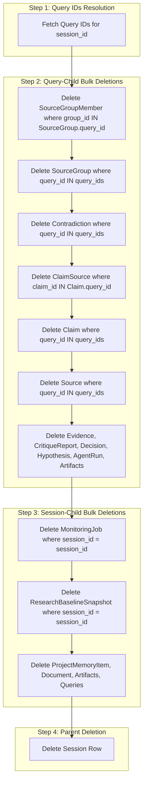

# Migration Notes: Automatic SQLite Column Migrations & Safe Bulk Deletions

## Executive Summary
This document details database schema evolution, migration mechanics, and operational guidelines for RADIS deployments, specifically highlighting:
1. **Automatic SQLite Incremental Column Migration**: Self-healing database initialization adding missing columns (`sources.query_id`, etc.) to existing SQLite databases without data loss.
2. **Safe Relational Bulk Deletion**: Dependency-ordered cascading deletion architecture preventing foreign key constraint violations during research thread deletion.

> [!NOTE]
> All REST API contracts and Server-Sent Event (SSE) channels remain **100% backward compatible**. The migrations described herein run automatically on application startup without requiring manual DDL script execution.

---

## 1. Automatic SQLite Incremental Column Migration

### 1.1 Context & Problem Statement
In earlier iterations of the schema, the `sources` table was defined without direct reference to `query_id` and several metadata fields. When the [`Source`](file:///c:/Users/user/OneDrive/Desktop/CODE/Research-And-Decision-Intelligence-System/backend/app/models/source.py) SQLAlchemy ORM model was extended to associate sources directly with research queries, SQLAlchemy's default `Base.metadata.create_all` could not update existing databases.
- `create_all` only creates tables if they do not exist; it does not issue `ALTER TABLE` statements for newly added columns on existing tables.
- Deployments with existing local database files (`radis.db` or `radis_dev.db`) encountered fatal errors:
  ```text
  sqlite3.OperationalError: no such column: sources.query_id
  ```

### 1.2 Migration Implementation (`_run_sqlite_column_migrations`)
To resolve this without requiring manual migrations, table drops, or Alembic overhead for local development, an automatic migration routine was introduced in [`backend/app/db/engine.py`](file:///c:/Users/user/OneDrive/Desktop/CODE/Research-And-Decision-Intelligence-System/backend/app/db/engine.py#L27-L46).

```python
def _run_sqlite_column_migrations(conn) -> None:
    """Safely adds any missing columns to SQLite tables without dropping data."""
    try:
        result = conn.exec_driver_sql("PRAGMA table_info(sources);").fetchall()
        if result:
            existing_cols = {row[1] for row in result}
            expected_cols = {
                "query_id": "CHAR(32)",
                "publisher": "VARCHAR",
                "source_type": "VARCHAR",
                "published_at": "DATETIME",
                "content_hash": "VARCHAR",
                "independence_group": "VARCHAR",
                "freshness_category": "VARCHAR",
            }
            for col_name, col_type in expected_cols.items():
                if col_name not in existing_cols:
                    conn.exec_driver_sql(f"ALTER TABLE sources ADD COLUMN {col_name} {col_type};")
    except Exception as e:
        import logging
        logging.getLogger(__name__).warning(f"SQLite migration check skipped or encountered error: {e}")
```

### 1.3 Execution Lifecycle
The migration hook is triggered during application startup in [`init_db()`](file:///c:/Users/user/OneDrive/Desktop/CODE/Research-And-Decision-Intelligence-System/backend/app/db/engine.py#L48):
1. **Schema Check**: When the application boots, `init_db()` acquires an async connection from the engine.
2. **Table Creation**: `Base.metadata.create_all` runs to create any newly introduced tables.
3. **Column Migration**: If the database URL indicates SQLite (`"sqlite" in db_url`), `conn.run_sync(_run_sqlite_column_migrations)` is executed.
4. **Introspection & Patching**: `PRAGMA table_info(sources)` inspects existing column names. Any column in `expected_cols` not found in `existing_cols` is added via `ALTER TABLE sources ADD COLUMN <name> <type>;`.
5. **Idempotency**: Running `init_db()` repeatedly is completely safe and idempotent. Existing columns are skipped, and existing table rows are preserved.

### 1.4 Migrated Columns Specification
| Column Name | SQL Type | Purpose | Nullable |
| :--- | :--- | :--- | :---: |
| `query_id` | `CHAR(32)` | Foreign key link associating retrieved source with specific research query | Yes |
| `publisher` | `VARCHAR` | Domain authority / publishing organization | Yes |
| `source_type` | `VARCHAR` | Origin classification (`web`, `academic`, `news`, `wikipedia`) | Yes |
| `published_at` | `DATETIME` | Publication timestamp for freshness ranking | Yes |
| `content_hash` | `VARCHAR` | SHA-256 hash of extracted text for content deduplication | Yes |
| `independence_group` | `VARCHAR` | Cluster identifier for source diversity validation | Yes |
| `freshness_category` | `VARCHAR` | Freshness tier (`realtime`, `recent`, `archive`) | Yes |

---

## 2. Safe Relational Bulk Deletion Architecture

### 2.1 The Cascading Deletion Challenge
A research session encompasses a complex tree of relational child records:
- Queries linked to the session
- Sources and Source Groups linked to queries
- Claims and ClaimSources linking claims to sources
- Contradictions, Evidence, Decisions, Hypotheses, Agent Runs, and Artifacts

Previously, attempting to delete a session by deleting queries iteratively triggered foreign key constraint failures (`sqlite3.IntegrityError: FOREIGN KEY constraint failed`) when child records (like `source_group_members` or `claim_sources`) referenced records being deleted out of order.

### 2.2 Dependency-Ordered Deletion Algorithm
In [`SessionService.delete_session`](file:///c:/Users/user/OneDrive/Desktop/CODE/Research-And-Decision-Intelligence-System/backend/app/services/session_service.py#L88), deletions are executed using set-based SQL operations in strict reverse-dependency order:



### 2.3 Deletion Order Matrix
| Phase | Target Table | Filter Condition | Rationale |
| :---: | :--- | :--- | :--- |
| **1** | `source_group_members` | `group_id IN (SELECT id FROM source_groups WHERE query_id IN (...))` | Must delete associative join table before parent groups. |
| **2** | `source_groups` | `query_id IN (...)` | Safely deleted after join members are removed. |
| **3** | `contradictions` | `query_id IN (...)` | References claims and queries. |
| **4** | `claim_sources` | `claim_id IN (SELECT id FROM claims WHERE query_id IN (...))` | Must delete claim-to-source mapping before deleting claims. |
| **5** | `claims` | `query_id IN (...)` | Deleted after join table references are removed. |
| **6** | `sources` | `query_id IN (...)` | Safely deleted now that claim links and groups are purged. |
| **7** | `evidence`, `critique_reports`, `decisions`, `hypotheses`, `agent_runs`, `data_query_records`, `visualization_specs`, `reproducible_artifacts`, `artifacts` | `query_id IN (...)` | Leaf query-level analytical records. |
| **8** | `monitoring_jobs`, `research_baseline_snapshots`, `project_memory_items`, `documents`, `artifacts`, `queries` | `session_id = ...` | Session-level entities and queries. |
| **9** | `sessions` | `id = ...` | Final parent session record. |

### 2.4 Performance & Safety Improvements
- **Set-Based Bulk Execution**: Rather than executing dozens of iterative single-row delete statements, `delete(Model).where(Model.query_id.in_(query_ids))` executes set-based bulk deletes, reducing transaction round-trips from $O(N \times M)$ to $O(1)$ database calls per entity type.
- **Defensive Exception Handling**: Each deletion stage is wrapped in defensive blocks to accommodate database drivers where foreign keys might already cascade or tables are unpopulated, preventing transaction rollback from empty child sets.
- **Clean UI Transition**: When a thread is deleted from the UI, the frontend seamlessly transitions the user to the next session (`remaining[0]`) or triggers a clean workspace reset (`handleNewSession()`).

---

## 3. Deployment & Upgrade Instructions

### 3.1 Upgrading Existing Deployments
No manual SQL scripts are required. To upgrade an existing deployment:
1. Pull latest repository changes:
   ```bash
   git pull origin main
   ```
2. Restart the backend server:
   ```bash
   uvicorn app.main:app --reload --port 8000
   ```
3. During startup, the backend automatically logs:
   ```text
   INFO: Database initialized with incremental column migration verification.
   ```
4. Verify table structure using SQLite CLI (optional):
   ```bash
   sqlite3 radis_dev.db "PRAGMA table_info(sources);"
   ```
   Confirm that `query_id`, `publisher`, `source_type`, `published_at`, `content_hash`, `independence_group`, and `freshness_category` appear in the output.

### 3.2 Verification Tests
Run the automated test suite verifying both column migration and cascade deletion:
```bash
# Verify session cascade delete
python -m pytest backend/tests/unit/test_session_cascade.py -v

# Verify session query filtering & timestamp touch
python -m pytest backend/tests/unit/test_issue1_session_query_fixes.py -v
```

---

## 4. Rollback Plan
In the unlikely event of migration issues:
1. **Schema Reversion**: The `sources` columns added are nullable and have no default constraint that affects reads. Downgrading backend code without altering the SQLite schema will continue to function normally.
2. **Database Backup**: As a standard best practice before applying upgrades in production, backup your SQLite database:
   ```bash
   cp radis_dev.db radis_dev.db.bak
   ```
