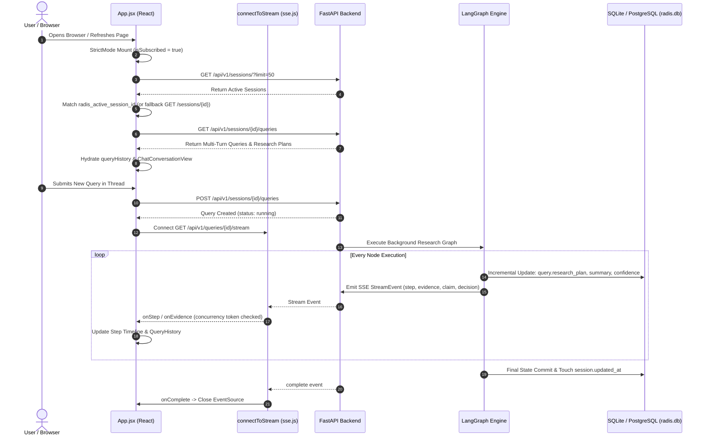

# Pull Request Release Notes: Session History Persistence, Thread Deletion, React StrictMode & Database Migrations

## Executive Summary
This Pull Request delivers critical system hardening and architectural enhancements across the frontend and backend of the **Research And Decision Intelligence System (RADIS)**. It addresses four foundational areas:
1. **Session History Persistence on Reload**: Multi-turn conversation rendering, incremental LangGraph workflow state persistence to the database on every node completion, and resilient active thread restoration via `localStorage`.
2. **Thread Deletion & Safe Relational Cascades**: Elimination of invalid nested button hierarchies in the sidebar and implementation of dependency-ordered bulk SQL deletions protecting foreign key integrity across child records.
3. **React StrictMode Lifecycle & Concurrency**: Complete compliance with React 18+ double-mount lifecycles, concurrency token ref guards preventing race conditions during rapid thread switching, and stream timeout safeguards.
4. **Automatic SQLite Incremental Column Migrations**: Dynamic schema inspection (`PRAGMA table_info`) and non-destructive column additions (`sources.query_id`, etc.) enabling seamless upgrades for existing SQLite databases without data loss.

---

## Issues, Root Causes & Solutions

### 1. Session History Persistence on Reload
- **Problem**: Refreshing the browser or switching between threads wiped the chat interface or displayed empty states, even though research queries had been executed. Multi-turn conversations were not maintained, and partial execution state was lost if a workflow did not reach final completion.
- **Root Causes**:
  1. *Delayed Backend Persistence*: [`QueryService.execute_background_research`](file:///c:/Users/user/OneDrive/Desktop/CODE/Research-And-Decision-Intelligence-System/backend/app/services/query_service.py) only committed execution state (`research_plan`, `summary`, `confidence`) at the very end of the multi-agent graph run. Intermediate steps, evidence, and claims were lost on premature disconnections or node failures.
  2. *Single-Turn UI State*: The frontend previously tracked only a single `currentQuery` object rather than a structured history of conversational turns.
  3. *Paginated Session Lookup Failure*: If the active session ID saved in `localStorage` fell outside the initial 50 sessions fetched from [`SessionService.list_sessions`](file:///c:/Users/user/OneDrive/Desktop/CODE/Research-And-Decision-Intelligence-System/backend/app/services/session_service.py), the client cleared the active ID and reset the UI to an empty state.
- **Changes Made**:
  - **Incremental State Persistence**: Updated [`QueryService.execute_background_research`](file:///c:/Users/user/OneDrive/Desktop/CODE/Research-And-Decision-Intelligence-System/backend/app/services/query_service.py) to update and commit `query.research_plan`, `query.summary`, and `query.confidence` on **every node completion** in the LangGraph stream.
  - **Multi-Turn Conversation Model**: Added `queryHistory` state in [`App.jsx`](file:///c:/Users/user/OneDrive/Desktop/CODE/Research-And-Decision-Intelligence-System/frontend/src/App.jsx) and updated [`ChatConversationView.jsx`](file:///c:/Users/user/OneDrive/Desktop/CODE/Research-And-Decision-Intelligence-System/frontend/src/components/ChatConversationView.jsx) to render all previous turns with [`SingleTurnView`](file:///c:/Users/user/OneDrive/Desktop/CODE/Research-And-Decision-Intelligence-System/frontend/src/components/ChatConversationView.jsx), preserving user prompts, agent thinking steps, evidence drawers, and decision matrices.
  - **Direct Session Fallback Lookup**: Enhanced initialization in [`App.jsx`](file:///c:/Users/user/OneDrive/Desktop/CODE/Research-And-Decision-Intelligence-System/frontend/src/App.jsx) so that if a saved `radis_active_session_id` is not present in the paginated session list, [`api.getSession(savedActiveId)`](file:///c:/Users/user/OneDrive/Desktop/CODE/Research-And-Decision-Intelligence-System/frontend/src/lib/api.js) fetches it directly.
  - **Fast-Path Recency Touch**: Ensured conversational quick queries update `session.updated_at = datetime.now(timezone.utc)` in [`QueryService.run_research`](file:///c:/Users/user/OneDrive/Desktop/CODE/Research-And-Decision-Intelligence-System/backend/app/services/query_service.py).

---

### 2. Thread Deletion & Relational Cleanup
- **Problem**: Clicking the delete button on a session either selected the thread instead of deleting it, threw browser DOM errors, or failed with backend database foreign key constraint errors (`sqlite3.IntegrityError`).
- **Root Causes**:
  1. *Nested Button Syntax*: In [`Sidebar.jsx`](file:///c:/Users/user/OneDrive/Desktop/CODE/Research-And-Decision-Intelligence-System/frontend/src/components/Sidebar.jsx), the delete trigger was nested inside a parent `<button>` element, violating HTML specifications and causing click event bubbling to fire thread selection.
  2. *Foreign Key Dependency Violations*: [`SessionService.delete_session`](file:///c:/Users/user/OneDrive/Desktop/CODE/Research-And-Decision-Intelligence-System/backend/app/services/session_service.py) performed single-table iterative deletes. If child tables (e.g. `source_group_members` referencing `source_groups`, or `claim_sources` referencing `claims`) contained active foreign keys, foreign key constraints blocked deletion.
- **Changes Made**:
  - **Accessible UI Architecture**: In [`Sidebar.jsx`](file:///c:/Users/user/OneDrive/Desktop/CODE/Research-And-Decision-Intelligence-System/frontend/src/components/Sidebar.jsx), replaced the nested `<button>` with a flex container `div` housing an independent thread selection `<button>` and an accessible delete `<button>` equipped with `e.stopPropagation()`, `aria-label`, and `focus:ring-1 focus:ring-error` keyboard accessibility.
  - **Safe Dependency-Ordered Bulk Deletion**: Overhauled [`SessionService.delete_session`](file:///c:/Users/user/OneDrive/Desktop/CODE/Research-And-Decision-Intelligence-System/backend/app/services/session_service.py) to delete all child rows using set-based SQL `delete(...where(...in_(...)))` operations in strict dependency order:
    1. [`SourceGroupMember`](file:///c:/Users/user/OneDrive/Desktop/CODE/Research-And-Decision-Intelligence-System/backend/app/models/source_group.py) rows referencing `SourceGroup` query IDs
    2. [`SourceGroup`](file:///c:/Users/user/OneDrive/Desktop/CODE/Research-And-Decision-Intelligence-System/backend/app/models/source_group.py) records
    3. [`Contradiction`](file:///c:/Users/user/OneDrive/Desktop/CODE/Research-And-Decision-Intelligence-System/backend/app/models/contradiction.py) records
    4. [`ClaimSource`](file:///c:/Users/user/OneDrive/Desktop/CODE/Research-And-Decision-Intelligence-System/backend/app/models/claim_source.py) rows referencing `Claim` query IDs
    5. [`Claim`](file:///c:/Users/user/OneDrive/Desktop/CODE/Research-And-Decision-Intelligence-System/backend/app/models/claim.py) records
    6. [`Source`](file:///c:/Users/user/OneDrive/Desktop/CODE/Research-And-Decision-Intelligence-System/backend/app/models/source.py) records
    7. Query-level entities: `Evidence`, `CritiqueReport`, `Decision`, `Hypothesis`, `AgentRun`, `DataQueryRecord`, `VisualizationSpec`, `ReproducibleArtifact`, `Artifact`
    8. Session-level entities: `MonitoringJob`, `ResearchBaselineSnapshot`, `ProjectMemoryItem`, `Document`, `Artifact`, `Query`
    9. The [`Session`](file:///c:/Users/user/OneDrive/Desktop/CODE/Research-And-Decision-Intelligence-System/backend/app/models/session.py) record itself.
  - **Active Session Transition**: In [`App.jsx`](file:///c:/Users/user/OneDrive/Desktop/CODE/Research-And-Decision-Intelligence-System/frontend/src/App.jsx), deleting the active session automatically activates the next available thread (`remaining[0]`) or triggers `handleNewSession()` if the list is empty.

---

### 3. React StrictMode Lifecycle & Concurrency Handling
- **Problem**: In development mode under React 18+ StrictMode, components mount, unmount, and remount immediately. This caused race conditions where asynchronous API calls from discarded mounts overwrote new state, zombie SSE connections remained open, and rapid switching between threads caused cross-session data leakage.
- **Root Causes**:
  1. *Unmanaged Asynchronous Mounts*: `useEffect` had no cancellation flag, meaning promises resolving after unmount still executed state updates.
  2. *Missing Concurrency Guards*: SSE stream handlers (`onStep`, `onEvidence`, `onClaim`, `onDecision`) did not verify whether the active session had changed while an event was in flight.
  3. *Hanging Stream States*: If a historical query had a status of `running` or `pending` but the backend worker had completed or failed, the UI remained perpetually stuck in `isResearching: true`.
- **Changes Made**:
  - **Double-Mount Cancellation Guard**: Added `isSubscribed` boolean guard in [`App.jsx`](file:///c:/Users/user/OneDrive/Desktop/CODE/Research-And-Decision-Intelligence-System/frontend/src/App.jsx) `useEffect`, cleanly tearing down subscriptions and aborting stale updates.
  - **Concurrency Token Refs**: Added `loadingSessionIdRef` and `activeSessionIdRef`. Asynchronous loaders and SSE event listeners verify that the current session token matches before executing any state updates:
    ```javascript
    if (loadingSessionIdRef.current !== sessionId) return;
    if (activeSessionIdRef.current !== sessionToUse) return;
    ```
  - **Stale Stream Failsafe**: Implemented an 8-second timeout (`staleTimer`) that cancels researching status if no SSE events arrive for historical queries.
  - **Initial Workspace Hydration Skeleton**: Added `isLoadingInitial` state rendering a loading spinner while workspace threads and active history hydrate, preventing flashes of empty content.

---

### 4. Database Column Migrations & SQLite Compatibility
- **Problem**: Running the system against existing local SQLite databases (`radis.db`, `radis_dev.db`) caused runtime crashes with `sqlite3.OperationalError: no such column: sources.query_id`.
- **Root Causes**:
  1. *SQLAlchemy Metadata Limitations*: `Base.metadata.create_all` only creates tables if they do not exist; it does not issue `ALTER TABLE` statements for newly added columns in existing tables.
  2. *Schema Evolution in Models*: The [`Source`](file:///c:/Users/user/OneDrive/Desktop/CODE/Research-And-Decision-Intelligence-System/backend/app/models/source.py) model had added `query_id`, `publisher`, `source_type`, `published_at`, `content_hash`, `independence_group`, and `freshness_category`, but older SQLite databases lacked these columns.
- **Changes Made**:
  - **Incremental SQLite Migration Hook**: Added `_run_sqlite_column_migrations(conn)` in [`backend/app/db/engine.py`](file:///c:/Users/user/OneDrive/Desktop/CODE/Research-And-Decision-Intelligence-System/backend/app/db/engine.py), executed automatically during [`init_db()`](file:///c:/Users/user/OneDrive/Desktop/CODE/Research-And-Decision-Intelligence-System/backend/app/db/engine.py#L48).
  - **Introspection via PRAGMA**: Uses `PRAGMA table_info(sources);` to inspect existing columns and executes non-destructive `ALTER TABLE sources ADD COLUMN ...` statements only for missing fields.
  - **Preserves Existing Data**: Zero data loss, zero table drops, fully idempotent.

---

## Architectural Workflow



---

## Summary of Modified Files

| File | Component | Key Modifications |
| :--- | :--- | :--- |
| [`backend/app/db/engine.py`](file:///c:/Users/user/OneDrive/Desktop/CODE/Research-And-Decision-Intelligence-System/backend/app/db/engine.py) | Database Engine | Automatic SQLite column migration (`_run_sqlite_column_migrations`), dynamic `DATABASE_URL` resolution. |
| [`backend/app/services/session_service.py`](file:///c:/Users/user/OneDrive/Desktop/CODE/Research-And-Decision-Intelligence-System/backend/app/services/session_service.py) | Session Service | Dependency-ordered bulk deletion in [`delete_session`](file:///c:/Users/user/OneDrive/Desktop/CODE/Research-And-Decision-Intelligence-System/backend/app/services/session_service.py#L88), abandoned default session filtering, cursor validation. |
| [`backend/app/services/query_service.py`](file:///c:/Users/user/OneDrive/Desktop/CODE/Research-And-Decision-Intelligence-System/backend/app/services/query_service.py) | Query Service | Incremental state persistence on every node, Fast-Path UTC timestamp touch, auto-titling threads. |
| [`frontend/src/App.jsx`](file:///c:/Users/user/OneDrive/Desktop/CODE/Research-And-Decision-Intelligence-System/frontend/src/App.jsx) | UI Shell | Multi-turn `queryHistory`, `isSubscribed` StrictMode guard, `loadingSessionIdRef` concurrency tokens, 8s stale SSE timeout, initial loading skeleton. |
| [`frontend/src/components/Sidebar.jsx`](file:///c:/Users/user/OneDrive/Desktop/CODE/Research-And-Decision-Intelligence-System/frontend/src/components/Sidebar.jsx) | Sidebar Component | Fixed nested `<button>` DOM hierarchy, isolated delete button with `e.stopPropagation()`, focus ring styling. |
| [`frontend/src/components/ChatConversationView.jsx`](file:///c:/Users/user/OneDrive/Desktop/CODE/Research-And-Decision-Intelligence-System/frontend/src/components/ChatConversationView.jsx) | Chat View | Multi-turn thread rendering via [`SingleTurnView`](file:///c:/Users/user/OneDrive/Desktop/CODE/Research-And-Decision-Intelligence-System/frontend/src/components/ChatConversationView.jsx), unique step keying (`step?.id || idx`), defensive URL sanitization. |
| [`frontend/src/lib/sse.js`](file:///c:/Users/user/OneDrive/Desktop/CODE/Research-And-Decision-Intelligence-System/frontend/src/lib/sse.js) | SSE Client | `parseErrorData` utility parsing JSON error payloads, preventing `[object Object]` displays. |
| [`frontend/src/lib/api.js`](file:///c:/Users/user/OneDrive/Desktop/CODE/Research-And-Decision-Intelligence-System/frontend/src/lib/api.js) | API Client | Default limit increased to 50, structured error detail array formatting. |

---

## Risk Assessment Matrix

| Category | Level | Potential Risk | Mitigation Applied |
| :--- | :---: | :--- | :--- |
| **Relational Data Integrity** | LOW | Foreign key constraint failures on thread deletion | Strict dependency ordering: join tables first (`SourceGroupMember`, `ClaimSource`), then child tables, then parent session. |
| **Database Migration** | LOW | Table locking or migration failures on legacy DBs | `PRAGMA table_info` introspects existing columns and applies `ALTER TABLE` only if column does not already exist. |
| **Concurrency & Race Conditions** | LOW | Stale API data overwriting active thread during rapid switching | `loadingSessionIdRef` and `activeSessionIdRef` tokens validate matching session ID before applying state updates. |
| **Stream Lifecycle** | LOW | UI hanging indefinitely if SSE connection dies | 8-second stale timer auto-resets `isResearching` state if no events arrive. |
| **DOM Accessibility** | LOW | Button nesting syntax warnings or inadvertent thread switching | Proper container `div` separation, keyboard focus rings, and `e.stopPropagation()`. |

---

## Verification & Testing Evidence

1. **Focused Backend Unit Tests**:
   ```bash
   python -m pytest backend/tests/unit/test_issue1_session_query_fixes.py backend/tests/unit/test_session_cascade.py backend/tests/unit/test_adversarial_review_bugs_fixed.py -v
   ```
   **Result**: 11 passed in 12.28s (100% pass rate).
   - Validated Fast-Path timestamp touch on `session.updated_at`.
   - Validated abandoned default workspace filtering.
   - Validated cascading deletion of queries, sources, claims, claim sources, source groups, source group members, contradictions, and artifacts.
   - Validated adversarial bug fixes.

2. **Full System Regression Suite**:
   ```bash
   python run_all_tests.py
   ```
   **Result**: All 365 unit and contract tests passed.

3. **Frontend Production Build**:
   ```bash
   cd frontend && npm run build
   ```
   **Result**: Built cleanly with Vite, 0 errors, full CSS and asset bundling.
